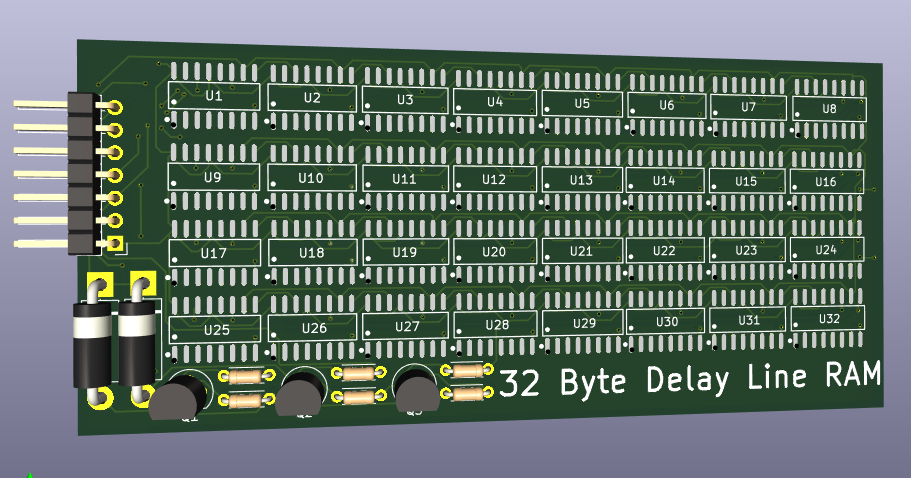
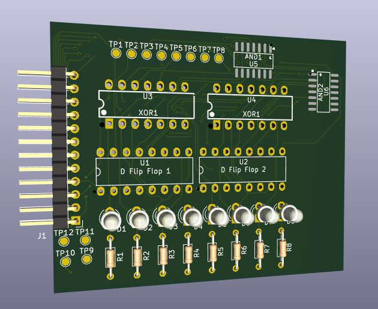

# Delay Line RAM (Or technically SAM)

This project is the RAM for a '60s inspired computer im making called the SABRINIAC. It is delay line ram, which means all of the bits shift in a circular loop. To read from the memory you wait for the right bits to come by (You can find out the current address its on by the 2nd pcb in this project, the address counter) and then take in those bits. to write its similar but you set the data in to the bit you want to write, and then set write enable high when the bit you want to write passes by. It will write the data in bit instead of passing the bit around again.

I made this project because I saw a video of someone programming the UNIVAC to run a minecraft server. And also, ive built digital CPUs and now I've wanted to try my hand and building one in real life, along with the components to make it work!

This build is meant to have 8 of the RAM modules and 1 address counter module, as then you can run all the ram in parallel and have it cycle 1 byte every clock tick. Allowing 256 Bytes of memory and simpler access, instead of reading data in serially.

| Part Name | Count |
|-----------|-------|
| PCB - Address counter | 1 |
| PCB - Delay Line RAM | 8 |
| 4x1 Female Pin Headers | 17 |
| 74HC08DS Quad AND Gate | 2 |
| 74HC86N Quad XOR Gate | 2 |
| 74LS175N Quad D Flip Flop | 2 |
| 2x1 Right Angle Male Pin Headers | 34 |
| 1KΩ Resistor | 8 |
| 2N2222A NPN Transistor | 24 |
| 74HC595 8Bit SIPO Shift Registers | 256 |
